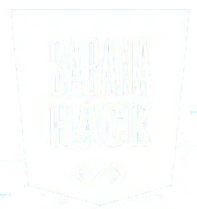

# SabanaHack2025


<p align="center">
        
</p>

<p align="center">

</p>

Este repositorio contiene la información y los recursos asociados al reto propuesto por la Cruz Roja Colombiana, la Alcaldía de Tocancipa y la Universidad de La Sabana en el marco del Sabana Hack 2025.


## Reto

Desarrollar una solución innovadora y aplicable en territorio, que mejore la resiliencia comunitaria ante riesgos de inundaciones. Algunas ideas que pueden considerar incluyen:

1. Sistema comunitario de alerta temprana:
Diseñar un mecanismo sencillo y de bajo costo (SMS, sirena, mensajes, app offline, banderas, etc.) que permita avisar a tiempo sobre la creciente de la quebrada y coordinar la respuesta entre los vecinos.
2. Solución basada en la Naturaleza (SbN) e ingeniería comunitaria:
Proponer una plataforma integrada para la gestión y el monitoreo participativo de solución basada en la naturaleza.
3. Otras estrategias de gestión de reducción de riesgos de desastres (basadas en la prevención y preparación) 


**>>Más información [aquí](./reto)<<**

## Recursos disponibles

El repositorio contiene diversos materiales de apoyo que facilitan la comprensión del contexto territorial, institucional y comunitario de la Vereda La Esmeralda (Tocancipá), así como la formulación de soluciones durante el hackathon.
A continuación, se describen los principales directorios contenidos en la carpeta [recursos](recursos) y su respectivo contenido:
- [```mapas/```](recursos/mapas)
Contiene mapas estáticos en formato PDF elaborados en 2010, que representan información clave sobre el territorio rural de Tocancipá. También incluye un enlace a la cartografía básica en línea.
- [```diagnostico_comunitario/```](recursos/diagnostico_comunitario) Reúne evidencias visuales y un resumen descriptivo del proceso de diagnóstico participativo realizado con la comunidad de La Esmeralda. Las fotografías documentan talleres, recorridos y actividades comunitarias, mientras que el archivo README.md contextualiza los principales hallazgos y percepciones locales sobre los riesgos de inundación y las capacidades de respuesta.
- [```politica_publica/```](recursos/politica_publica): Incluye documentos oficiales y de referencia sobre la gestión del riesgo en el municipio.
- [```reto/```](./reto): Contiene la propuesta del reto del hackathon, con un archivo README.md que describe el desafío, los objetivos y los criterios de evaluación y una presentación en PowerPoint que resume los elementos principales para su divulgación durante el evento.
- [```sbn/```](recursos/sbn): Reúne documentos útiles para comprender las Soluciones Basadas en la Naturaleza (SbN).

## Mentoria

Contarán con el acompañamiento de mentores. Ellos estarán disponibles para resolver dudas, compartir su experiencia y apoyar a los equipos en la formulación de soluciones creativas y viables:
* Luz Elba Torres Guevara (Universidad de la Sabana, EICEA)
* Juan José Diaz (Cruz Roja Colombiana Seccional Bogota y Cundinamarca)
* William Guerrero (Universidad de la Sabana, Facultad de Ingeniería)
* Mariam Bouzid (Universidad de la Sabana, Facultad de Ingeniería)


Además, se abrirá un grupo en Teams, Discord o WhatsApp para facilitar la comunicación, el intercambio de ideas y la coordinación entre los participantes y los mentores.
## Quiénes somos

Somos un equipo transdisciplinario e interinstitucional comprometido con la gestión del riesgo de inundaciones y la resiliencia comunitaria en la Vereda la Esmeralda en Tocancipá, Cundinamarca, Colombia. Desde la ingeniería industrial, la economía circular, la ingeniería civil y la logística humanitaria, integramos conocimientos y metodologías diversas para abordar de manera integral los desafíos del territorio. El proyecto se desarrolla en colaboración interinstitucional entre la Cruz Roja Colombiana Seccional Bogota y Cundinamarca, la Universidad de La Sabana y la Alcaldía de Tocancipá, fortaleciendo los vínculos entre ciencia, acción y comunidad.
<table align="center">
  <tr>
    <td align="center"><br>Universidad de La Sabana (Facultad de Ingeniería y EICEA)</td>
    <td align="center"><br>Alcaldía de Tocancipá</td>
    <td align="center"><br>Cruz Roja Colombiana Seccional Bogota y Cundinamarca</td>
  </tr>
</table>


