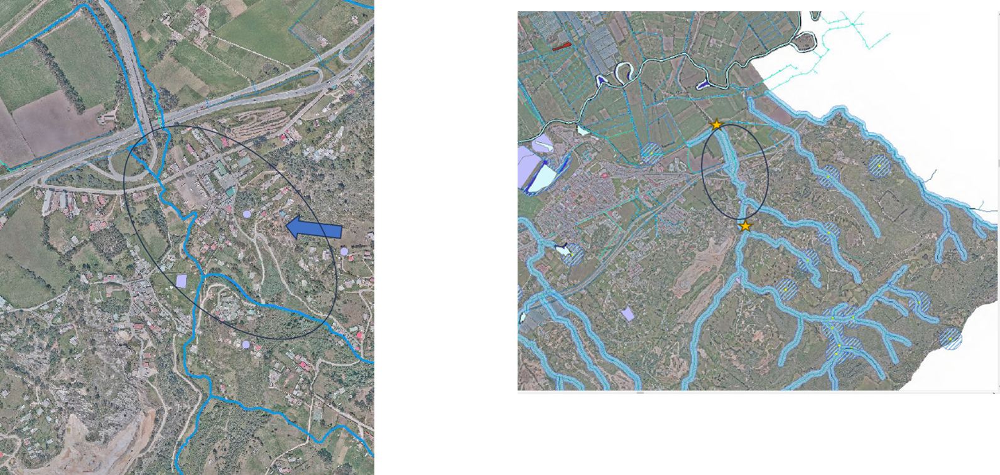
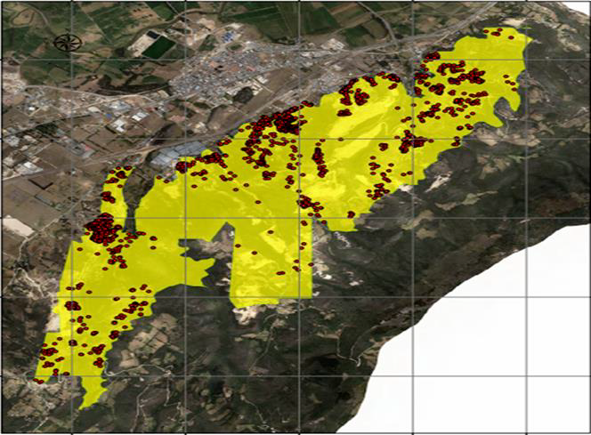
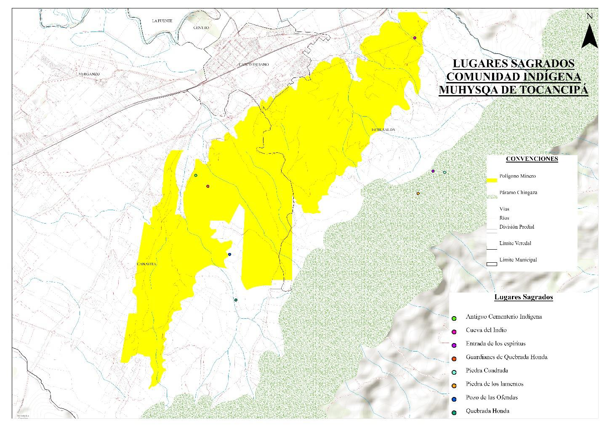
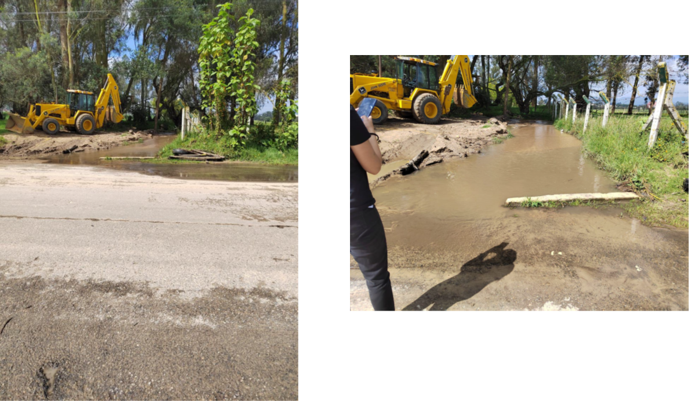

# Consolidado del conocimiento

## Resumen
### 1. Caracterización del Territorio

#### 1.1. Localización y contexto geográfico
La quebrada La Esmeralda se localiza en la vereda del mismo nombre, en el municipio de Tocancipá, Cundinamarca, dentro del altiplano cundiboyacense. 
Este territorio forma parte del polígono minero delimitado por la Resolución 2001 de 2016, la cual establece las zonas compatibles con la explotación de materiales de construcción en la Sabana de Bogotá. Cabe destacar que esta región ha sido declarada de interés ecológico nacional mediante la Ley 99 de 1993, lo que resalta su importancia ambiental y la necesidad de una gestión sostenible de sus recursos.

* Ubicación: [(4.968338591421804, -73.89965716797657)](https://maps.app.goo.gl/uFDXmyFTatfgmQQJ6)

#### 1.2. Actividades antrópicas

* **Minería**: Actividad predominante en la zona, con múltiples títulos mineros activos. Las empresas responsables incluyen Arenas y Rocas Villamaría S.A.S., Mastercat S.A.S., Tocarena, entre otras.
* **Urbanización informal**: A pesar de la prohibición legal, se ha registrado un crecimiento significativo de viviendas dentro del polígono minero. Entre 2015 y 2023, las viviendas pasaron de 1.366 a 1.762, un aumento del 29%.
* **Agricultura y ganadería**: Actividades en menor escala, principalmente para autoconsumo.

#### 1.3. Factores climáticos y ambientales

* **Zonas de recarga hídrica**: La vereda Esmeralda incluye áreas de recarga hídrica vulnerables, esenciales para el abastecimiento de agua.
* **Alteración del ciclo hidrológico**: La minería ha modificado el cauce natural de cuerpos de agua, incluyendo la quebrada La Esmeralda, afectando su capacidad de drenaje y provocando colmatación.

#### 1.4. Caracterización de las inundaciones

##### 1.4.1. Tipo de inundacion
* **Pluviales**: Por impermeabilización del suelo y falta de infraestructura de drenaje.
* **Fluviales**: Por colmatación de la quebrada y alteración de su cauce natural debido a sedimentos y residuos mineros.

##### 1.4.2. Afectación

Se reporta que las inundaciones atípicas han afectado la parte baja del polígono minero, generando:

* Daños materiales en viviendas.
* Riesgos para la integridad física de los habitantes.
* Afectación a la movilidad y accesibilidad en sectores poblados.

##### 1.4.3. Histórico de eventos
No son fenómenos aislados, sino que han sido recurrentes en los últimos años, especialmente desde el crecimiento acelerado de viviendas entre 2015 y 2023.

* **18 de marzo de 2023**: un evento de lluvias intensas provocó inundaciones significativas en la vereda La Esmeralda, afectando especialmente las quebradas Quindingua, Barriales y La Esmeralda. 

### 2. Caracterización de la Población
#### 2.1. Composición demográfica

* En el año 2023, se estiman aproximadamente 8.810 habitantes (basado en 1.762 viviendas y un promedio de 5 personas por hogar) dentro del polígono minero de Tocancipá.
* Una parte significativa de esta población corresponde a la comunidad indígena Muhysqa, históricamente asentada en las veredas La Esmeralda y Canavita, territorios que hasta 1979 formaban parte del resguardo indígena de Tocancipá.

* El crecimiento poblacional ha sido significativo, con un incremento de aproximadamente 1.980 personas entre los años 2015 y 2023.
* Los asentamientos se concentran principalmente en las veredas Canavita y La Esmeralda, donde se ha observado una ocupación progresiva del territorio a través de la subdivisión de predios familiares.

#### 2.2. Tipología de la población

La población que habita el polígono minero de Tocancipá es diversa y presenta distintas características socioeconómicas y culturales.

* Se encuentran las comunidades tradicionales, conformadas por familias que han residido en el territorio por más de 30 años. 
* Por otro lado, se identifican los **arrendatarios**, es decir, personas que han llegado en años recientes, atraídas principalmente por la cercanía a las zonas industriales y la posibilidad de acceder a vivienda informal a bajo costo
* Una parte importante de los habitantes del polígono se encuentra en condición de vulnerabilidad. Se trata de hogares que han construido sus viviendas sin licencias urbanísticas, en zonas no legalizadas, y que carecen de servicios básicos como agua potable, alcantarillado o energía eléctrica. 

##### 2.2.1. Comunidad Muhysqa
* La comunidad Muhysqa mantiene una presencia activa y organizada a través de su cabildo indígena, la guardia indígena y el Consejo Ambiental Indígena.
* En septiembre de 2022, el Ministerio del Interior reconoció oficialmente a la comunidad indígena Muhysqa de Tocancipá mediante la Resolución 108, identificando a 294 familias ubicadas principalmente en las veredas Canavita y La Esmeralda.
* Esta comunidad ha sido históricamente marginada y despojada de sus tierras, pero ha mantenido su identidad cultural, sus prácticas ancestrales (como la alfarería, los rituales de pago a la tierra y la medicina tradicional) y su lucha por la defensa del territorio.
* A pesar de las presiones del modelo extractivo, la comunidad ha fortalecido su identidad como protectora del territorio, promoviendo una visión del Buen Vivir basada en la reciprocidad con la naturaleza, la espiritualidad y la armonía comunitaria.

#### 3. Problemática Socioambiental
##### 3.1. Riesgos ambientales
a) Contaminación hídrica

* Colmatación de la quebrada La Esmeralda por sedimentos provenientes de la minería.
* Mal diseño y mantenimiento de pozos sedimentadores, lo que impide la retención adecuada de residuos.
* Alteración del cauce natural, afectando la biodiversidad y la calidad del agua.

b) Inundaciones atípicas

* Ocurren en la parte baja del polígono minero.
* Relacionadas con la falta de obras hidráulicas adecuadas y la ocupación de zonas de riesgo.

c) Contaminación atmosférica

* Material particulado generado por el tránsito de volquetas en mal estado.
* Ruido y vibraciones por uso de explosivos (ANFO), afectando viviendas cercanas.

##### 3.2. Riesgos sociales
a) Conflicto por uso del suelo

El suelo está legalmente destinado a minería, pero ha sido ocupado por viviendas sin licencia.
Las autoridades locales carecen de herramientas para regular o legalizar estos asentamientos.

b) Seguridad vial

Circulación de volquetas en horarios escolares, generando riesgos para niños y jóvenes.
Ambigüedad en la redacción del Decreto 020 de 2022 ha dificultado su aplicación efectiva.

c) Tensión entre actores

Reuniones comunitarias marcadas por confrontaciones entre residentes, autoridades y empresarios mineros.
Falta de cumplimiento de acuerdos previos por parte de las empresas.

### 4. Gestión del Riesgo y Propuestas Comunitarias
##### 4.1. Acciones institucionales

* Inspecciones técnicas a títulos mineros activos.
* Capacitaciones sobre normativa minera organizadas por la CAR.
* Decretos municipales para regular el tránsito de volquetas.
* Intervenciones oficiales de dragado o limpieza con maquinaria

##### 4.2. Articulación con el plan municipal de gestion del riesgo (PMGR, 2017)

###### Medidas de reducción del riesgo

- Restauración ambiental de rondas hídricas y revegetalización de taludes.
- Canalización y mantenimiento periódico de quebradas y drenajes.
- Control de vertimientos y disposición de escombros.
- Prohibición de construcciones en zonas inundables.
- Articulación con el POT para ordenar el uso del suelo según el riesgo hídrico.

###### **Medidas de preparación y respuesta**

- Fortalecimiento del sistema de alerta temprana (monitoreo de caudales y lluvias).
- Capacitación a la comunidad y organismos de socorro.
- Simulacros de evacuación y planes familiares de emergencia.
- Definición de rutas de evacuación y puntos seguros.

###### **Protección financiera y recuperación post-desastre**

- Creación del Fondo Municipal de Gestión del Riesgo (FMGRD).
- Aseguramiento de bienes públicos en riesgo.
- Inclusión de criterios de reducción del riesgo en procesos de reconstrucción

##### 4.3. Limitaciones y propuestas comunitarias
* La comunidad no se cuenta con alertas tempranas ante inundaciones.
* Tiene un grupo de WhatApp de la Junta de Acción Comunal. 

Laa comunidad está en una etapa intermedia de apropiación del riesgo:
* Reconoce las amenazas y su recurrencia.
* Posee experiencias empíricas y de cooperación vecinal.
* Pero aún carece de estructuras permanentes (comités, planes de acción, sistemas de alerta) y vínculos efectivos con instituciones.

