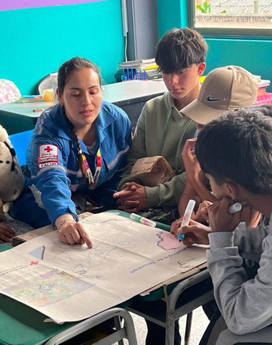
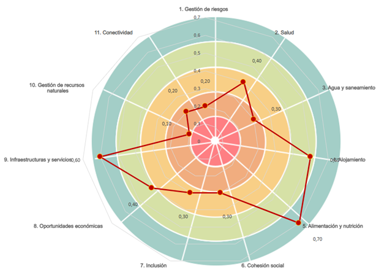

# Diagnóstico Comunitario AVCA Tocancipá

<table>
<thead>
<tr class="header">
<th></th>
</tr>
</thead>
<tbody>
<tr class="odd">
<td>
<strong>Elaboró:</strong>

Giovanna Rojas – Coordinadora Local

Lina Bojacá - Voluntaria

Vilma Gómez - Voluntaria
</td>
</tr>
</tbody>
</table>

# INTRODUCCIÓN

El proyecto de Desarrollo de habilidades en logística humanitaria para
mejorar la resiliencia comunitaria y la gestión de recursos hídricos
ante riesgos de inundaciones de la quebrada La Esmeralda en Tocancipá,
es liderado por la Universidad de La Sabana en articulación con el
Alcaldía de Tocancipa y la Cruz Roja Colombiana Seccional Cundinamarca y
Bogotá.

El siguiente diagnóstico es el resultado de la aplicación de la
metodología de Análisis de Vulnerabilidades y Capacidades Ampliado de la
Federación Internacional de la Cruz Roja, aplicado mediante herramientas
participativas de orden cualitativo y cuantitativo, con la comunidad
aledaña a la Quebrada la Esmeralda en el municipio de Tocancipa.

## General

Evaluar las capacidades actuales en logística humanitaria y gestión de
recursos hídricos de Tocancipá, a partir de información primaria, con el
fin de identificar fortalezas y oportunidades de mejora relacionadas con
la gestión de riesgos asociados a inundaciones.

## Específicos

  - Identificar las Amenazas, Vulnerabilidades y posibles Capacidades a
    potencializar de las comunidades de la Quebrada La Esmeralda.

  - Recabar datos con las comunidades que permitan diseñar e implementar
    programas de capacitación,basados en metodologías de investigación
    acción

  - participativa, orientados a mejorar la resiliencia comunitaria y
    optimizar la gestión de los recursos hídricos, en colaboración con
    actores locales e internacionales.

# Herramientas AVCA

La metodología del AVCA basa en un **conjunto amplio y adaptable de
técnicas participativas** (como mapas de riesgos, diagramas de Venn,
líneas de tiempo, entrevistas, etc.). Que analizan información desde
diferentes dimensiones, en esta aplicación se enfocó su aplicación en el
impacto de las inundaciones por lo que se eligieron las siguientes
herramientas:

## Estrella de la Resiliencia

La estrella de la Resiliencia realizada con la comunidad en la vereda de
la Esmeralda en el municipio de Tocancipá arroja los siguientes
resultados:

Ilustración 1 Estrella de la resiliencia - vereda La Esmeralda,
Tocancipá

Fuente: Construcción con la comunidad de la Vereda la Esmeralda,
Tocancipá

En lo relacionado con la gestión del riesgo, la comunidad no cuenta con
un equipo de respuestas a desastres que este activo y capacitado, no
tienen un sistema robusto que alerte a los residentes de cualquier
peligro o pronostico y por lo tanto no examinan los riesgos para
disminuir su impacto. Por otra parte, las viviendas están construidas
siguiendo algunas normas de seguridad, mas no todas las necesarias, esto
indica que los hogares no están preparados ante futuros desastres.

Con respecto a la dimensión de salud la comunidad conoce las
enfermedades que los afectan y asisten a las EPS para ser atendidos.
Cuentan con campañas de vacunación como medida apropiada para reducir la
propagación de las enfermedades. El acceso a servicios sanitarios no es
estable, ni confiable. Los hogares usan los servicios sanitarios
existentes, aunque no cuentan con un puesto de salud en la vereda y
deben desplazarse a la parte urbana o pueblo del municipio, lo cual se
agrava porque no cuentan con buenas vías y servicio de transporte
idóneo.

En cuanto al agua y saneamiento la comunidad cuenta con acceso a fuentes
seguras de agua, el servicio público de agua y pozos subterráneos.
Durante todo el año tienen servicio de agua para el consumo y la higiene
personal, aunque hay temporadas de escases e inconvenientes
administrativos para adquirir el servicio para nuevas viviendas. La
pandemia les dejo el habito de lavarse las manos de manera correcta y en
el territorio no existen letrinas, todos los hogares cuentan con
sanitarios.

En la comunidad los hogares han sido construidos con base en algunas
normas de seguridad en apoyo con la oficina de planeación municipal, por
lo tanto, las normas de construcción existen y se cumplen. La oficina de
planeación organiza los mecanismos de planeación para ubicar viviendas
en el sector y accesos. Las viviendas son apropiadas y con suficiente
espacio. La comunidad no cuenta con sistemas de apoyo para familias
vulnerables que tengan dificultades con sus viviendas.

Los participantes manifiestan que tienen para alimentarse durante todo
el año, pero no toda la comunidad puede acceder por el encarecimiento de
la canasta familiar. Para los tiempos de crisis no cuentan con reserva
de alimentos, algunos poseen huertas de pan coger en sus terrenos, pero
alcanza solo para el grupo familiar. Están capacitados sobre las dietas
saludables y la importancia para su bienestar, pero no pueden ser
rigorosos porque algunos productos son muy costosos y sobrepasan lo
presupuestado para la alimentación.

En cuanto a la cohesión social la comunidad tiene un gran sentido de
pertenencia y el nivel de confianza es bueno. Trabajan en conjunto
cuando se les presentan desafíos comunes (como en el momento de las
inundaciones) pero no hay un trabajo colectivo constante para mejorar
las condiciones de vida. No cuentan con organizaciones comunitarias o
grupo especiales. Se sienten seguros al interior de la comunidad y
manejan bien los conflictos emergentes, opuesto a la relación que tienen
con la administración municipal y el gremio empresarial, los cuales no
los escuchas ni los tienen en cuenta y los discriminan por ser
indígenas.

En términos de inclusión la población se escucha y abordan los problemas
específicos de hombres y mujeres en las decisiones internas de la
comunidad, de hecho, la Junta de Acción Comunal está conformada en su
mayoría por mujeres. No cuentan con personas en condiciones de
discapacidad. Con respecto a la relación de la comunidad indígena
presente en la vereda, con los entes gubernamentales y los empresarios
locales es casi inexistente, no les permiten participar en los asuntos
globales de la comunidad por su condición étnica. Es decir que no se
tiene en cuenta los intereses de todos los grupos poblacionales en la
toma de decisiones municipales.

Las oportunidades económicas son mínimas en el municipio, de ahí que la
mayoría de la población en edad laboral se desplace a Bogotá o
municipios cercanos a trabajar. Los hogares cuentan con ingresos de la
económica informal, floristería, construcción y del mantenimiento de
semovientes que por lo general corren riesgos en los deslizamientos que
producen las inundaciones. Las necesidades básicas son parcialmente
satisfechas con los ingresos procedentes de dichas actividades. Los
medios de vida se ven afectados por las perturbaciones o factores de
estrés externos (inflación, canasta familiar, etc). Las familias no
cuentan con medidas de resiliencia en tiempo de crisis, como seguros,
ahorros, acceso a créditos.

En lo que respecta a infraestructura y servicios, existen
establecimientos de educativos para niños y adolescentes, pero de muy
baja calidad. Cuentan con un débil acceso a los servicios
administrativos, y en relación con los servicios públicos tienen acceso
a todos, pero el alcantarillado no es muy bueno y el servicio de agua es
irregular. La infraestructura y servicios de salud no es eficaz ni
fiable.

No existe un sistema que asegure el uso sostenible y conservación de los
recursos naturales y no se cumplen las normas al respecto, por lo tanto,
no se preservan los recursos para las generaciones futuras; son
conscientes que el cambio climático los afecta, pero no han desarrollado
competencias para mitigarlo. La comunidad no tiene vínculos solidos con
los organismos gubernamentales porque no suelen tener en cuenta las
opiniones de la comunidad indígena, de igual manera no existen lazos
fuertes con organizaciones externas; cuentan con acceso a la información
a través de los medios tradicionales, pero no cuentan con internet.

.

## Perfil Histórico

En esta sección se presentan los resultados del ejercicio de perfil
histórico adelantando con la población participante (aprox. 9 personas)
de la vereda La Esmeralda del espacio de taller el sábado 2 de agosto de
2025.

Al iniciar el espacio se contaba con la participación de 5 personas,
entre ellos uno de los lideres del cabildo indígena. Luego de haber
iniciado llegaron más habitantes del sector para un aproximado de 9
personas, en su mayoría indígenas. Aproximadamente el 60% de los
participantes eran mujeres.

Tabla 1 Perfil Histórico vereda La Esmeralda, Tocancipá

<table>
<thead>
<tr class="header">
<th><strong>PERFIL HISTÓRICO</strong></th>
<th></th>
<th></th>
<th></th>
</tr>
</thead>
<tbody>
<tr class="odd">
<td><strong>FECHA</strong></td>
<td><strong>EVENTO</strong></td>
<td><strong>AFECTACIÓN COMUNITARIA</strong></td>
<td><strong>INSTITUCIÓN QUE APOYA</strong></td>
</tr>
<tr class="even">
<td>1574</td>
<td><blockquote>

Inicio del proceso cédula real sobre los terrenos de la comunidad.

</blockquote></td>
<td></td>
<td></td>
</tr>
<tr class="odd">
<td>1758</td>
<td><blockquote>

Entrega Cédula real de la corona de España a la comunidad indígena muisca de Tocancipá

</blockquote></td>
<td></td>
<td></td>
</tr>
<tr class="even">
<td>1810</td>
<td><blockquote>

Llega el primer regidor

</blockquote></td>
<td><blockquote>

Población empieza a ser desplazada a las montañas desde la sabana (hoy parque Jaime Duque).

</blockquote></td>
<td></td>
</tr>
<tr class="odd">
<td>1900</td>
<td><blockquote>

Expulsión de la comunidad de las áreas más bajas de la montaña (Jaime duque)

</blockquote></td>
<td><blockquote>

Desplazamiento de la población.

</blockquote></td>
<td><blockquote>

Ganado desplaza población

</blockquote></td>
</tr>
<tr class="even">
<td>1965</td>
<td><blockquote>

La Esmeralda y Cannabita quedan en escritura pública-

</blockquote></td>
<td><blockquote>

Auge del sector minero

</blockquote></td>
<td><blockquote>

Estado nacional y gobierno local

</blockquote></td>
</tr>
<tr class="odd">
<td>1969</td>
<td><blockquote>

Adecuación de vía que hoy día pasa por enfrente de colegio.

</blockquote></td>
<td><blockquote>

Permite a la comunidad tener una vía de acceso adecuada.

</blockquote></td>
<td><blockquote>

Adecuada por la comunidad.

</blockquote></td>
</tr>
<tr class="even">
<td>1976</td>
<td><blockquote>

Inicia volteo de tierras (cambio de usos del suelo en los planes para desplazamiento de la población)

</blockquote></td>
<td></td>
<td></td>
</tr>
<tr class="odd">
<td>1978 - 1979</td>
<td><blockquote>

Disolución del resguardo, entrega tierras sin títulos a algunos lideres de la comunidad por parte del INCORA.

</blockquote></td>
<td><blockquote>

Aparecen escrituras falsas, con la aparición de la notaría del municipio, a cada persona le entregaban una parcela

Exterminio cultural – a la población le empieza a dar pena decir que es indígena.

</blockquote></td>
<td><blockquote>

INCORA

</blockquote></td>
</tr>
<tr class="even">
<td>1990</td>
<td><blockquote>

Creación de polígonos mineros

</blockquote></td>
<td><blockquote>

Arreglo con dinero con población indígena que no tenía títulos a razón del proceso que había realizado el INCORA para adquisición de predios para la minería.

</blockquote></td>
<td><blockquote>

Alcaldes promovieron

</blockquote></td>
</tr>
<tr class="odd">
<td>1990</td>
<td><blockquote>

Con la llegada de la minería se construye la carretera para el acceso a las minas. Carretera del costado sus de la quebrada.

</blockquote></td>
<td></td>
<td><blockquote>

Las familias mineras

</blockquote></td>
</tr>
<tr class="even">
<td>2000</td>
<td><blockquote>

Creciente más anterior que recuerda la comunidad

</blockquote></td>
<td><blockquote>

La quebrada creció, pero no fue tan grave como en el 2023, no hubo grandes afectaciones.

</blockquote></td>
<td></td>
</tr>
<tr class="odd">
<td>2008</td>
<td><blockquote>

Se crea el frente de seguridad de la Esmeralda.

</blockquote></td>
<td><blockquote>

Mayor seguridad en la zona.

</blockquote></td>
<td><blockquote>

Desde la alcaldía se respalda.

</blockquote></td>
</tr>
<tr class="even">
<td>2014</td>
<td><blockquote>

Cambio de polígono de agrícola a zona de alto riesgo.

</blockquote></td>
<td><blockquote>

No permite tener licencias de construcción y por ende se dificulta el acceso a servicios públicos.

</blockquote></td>
<td><blockquote>

POT 2014

</blockquote></td>
</tr>
<tr class="odd">
<td>2016</td>
<td><blockquote>

Construcción PTAR/ PTAP (no es claro si es PTAR o PTAP pues la comunidad dice que es para tratamiento de agua potable y el representante de la alcaldía menciona que es para aguas residuales)

</blockquote></td>
<td></td>
<td></td>
</tr>
<tr class="even">
<td>2018</td>
<td><blockquote>

Creciente

</blockquote></td>
<td><blockquote>

Menos fuerte de 2023 – fue fuerza media.

</blockquote></td>
<td></td>
</tr>
<tr class="odd">
<td>2018 - 2020</td>
<td><blockquote>

Intervención de la cuenca con maquinaria para retirar sedimentos y limpiar la cuenca.

</blockquote></td>
<td><blockquote>

Erosión: arrastre de material, deslizamientos, la carretera se partió pues la quebrada buscaba el material.

</blockquote></td>
<td><blockquote>

Mineros enviaron la maquinaria y la alcaldía apoyo.

</blockquote></td>
</tr>
<tr class="even">
<td>2023</td>
<td><blockquote>

Inundaciones, las más fuertes hasta el momento, de acuerdo con la percepción de la población.

</blockquote></td>
<td><blockquote>

Bajo agua más allá del puente, el agua trajo arena y hasta el día de hoy ha afectado la fertilidad de las tierras pues no se ha podido volver a cultivar.

</blockquote></td>
<td></td>
</tr>
<tr class="odd">
<td>2024</td>
<td><blockquote>

Llegan a las casas intentando declarar riesgo (Estudios)

</blockquote></td>
<td><blockquote>

Querían desplazar a la población por estar en riesgo.

</blockquote></td>
<td><blockquote>

Alcaldía envía el estudio, los lideres de la comunidad intervienen.

</blockquote></td>
</tr>
</tbody>
</table>

*Fuente: elaboración propia*

Durante el espacio se inició con el recuento de hitos históricos para la
comunidad. Inmediatamente la población resalto la creciente del 2023
como el evento de mayor recordación para ellos.

En general se puede percibir que la población destaca los hitos que
ellos perciben que los han afectado de forma negativa, en los que están
involucrado autoridades tanto del nivel nacional local. Ejemplo de lo
anterior son los momentos relacionados con la tenencias y usos de la
tierra.

El periodo más álgido con el tema de la tenencia de las tierras se da
entre 1976 y 1979, pues el INCORA interviene entregaron tierras a
algunos lideres de la comunidad indígena, pero sin documentos. Para 1978
con la creación de la Notaria de Tocancipá aparecen escrituras
(comunidad afirma que eran falsas) las cuales permiten a población
externa hacer reclamaciones de predios en el territorio indígena (vereda
La Esmeralda) para actividad minera, sobre predios en los que la
comunidad estaba asentada desde hace varios siglos, lo cual obliga a una
parte de la población a desplazarse. Con este hito la comunidad también
destaca que en ese momento inicia lo que ellos denominan “exterminio
cultural”.

## Mapeo

Durante el mismo espacio en el que se adelantó el perfil histórico se
adelantó en paralelo el levantamiento de información del mapeo, sin
embargo, este espacio se centró en identificar capacidades y amenazas en
el territorio.

<table>
<thead>
<tr class="header">
<th><strong>MAPEO DE RIESGOS</strong></th>
<th></th>
<th></th>
<th></th>
</tr>
</thead>
<tbody>
<tr class="odd">
<td><strong>AMENAZAS</strong></td>
<td><strong>VULNERABILIDADES</strong></td>
<td><strong>CAPACIDADES</strong></td>
<td><strong>EXPOSICIÓN</strong></td>
</tr>
<tr class="even">
<td><blockquote>

Contaminación aguas arriba

</blockquote></td>
<td><blockquote>

Están aislados, pues el transporte no llega

</blockquote></td>
<td><blockquote>

Conocimientos de medicina ancestral y zona con plantas silvestres para la preparación de remedios ancestrales.

</blockquote></td>
<td></td>
</tr>
<tr class="odd">
<td><blockquote>

Shut de basura que las aguas se llevan cuándo la quebrada crece

</blockquote></td>
<td><blockquote>

No cuentan con atención en salud en el territorio, deben esperar a que llegue la respuesta desde el casco urbano.

</blockquote></td>
<td><blockquote>

Peñas blancas (sitio sagrado), es donde habita el Moan. Quién está a cargo de las descargas de agua.

</blockquote></td>
<td></td>
</tr>
<tr class="even">
<td><blockquote>

Inundaciones, pero la quebrada no se toma como amenaza

</blockquote></td>
<td></td>
<td><blockquote>

Cueva del Indio (sitio sagrado)

Piedra cuadrada.

</blockquote></td>
<td></td>
</tr>
<tr class="odd">
<td><blockquote>

Las minas se presentan como amenaza pues afectan el balance del territorio y del cuerpo de agua

</blockquote></td>
<td></td>
<td><blockquote>

Escuela

</blockquote></td>
<td></td>
</tr>
<tr class="even">
<td></td>
<td></td>
<td><blockquote>

Salón comunal para reuniones de la comunidad.

</blockquote></td>
<td></td>
</tr>
<tr class="odd">
<td></td>
<td></td>
<td><blockquote>

Tiendas para lo básico, tomar cerveza y elementos de vivieres y medicamentos muy básicos.

</blockquote></td>
<td></td>
</tr>
<tr class="even">
<td></td>
<td></td>
<td><blockquote>

La quebrada como capacidad en el pasado, pues era fuente de agua, de alimentos pues servía para riego y bienestar porque la gente iba a recargarse.

</blockquote></td>
<td></td>
</tr>
</tbody>
</table>

*Fuente: elaboración propia*

La población que participó del espacio era en su mayoría indígena, así
que en su mayoría las capacidades están relacionadas con la cosmovisión
de esta población y el carácter ancestral del territorio y los espíritus
que en el habitan.

### Amenazas 

La población destaco la contaminación como amenaza pues contamina la
quebrada en los momentos de las crecientes

### Vulnerabilidades

Respecto a la vulnerabilidad la población durante el espacio del taller
mencionó estar aislados pues no llega transporte público a la vereda y
por ejemplo para traer el mercado en ocasiones hay que pagar taxi y no
todo el mundo se lo puede permitir.

Adicionalmente no cuentan con atención en salid en el territorio por lo
que deben esperar a que llegue la respuesta desde el centro del pueblo.

### Capacidades

El conocimiento de por parte de los “abuelos” de la población indígena
se destaca como una de las capacidades que se tienen en el territorio,
que permite aprovechar la zona dónde aún se cuentan con plantas
silvestres que son empleadas para preparar remedios ancestrales para el
tratamiento de los males cotidianos.

Así mismo se destacaron los sitios sagrados como capacidad pues son
reconocidos por la comunidad indígena como lugares donde habita el Moan
y que permiten el equilibrio del territorio.

## Entrevistas semi estructuradas

Con el fin de complementar la información obtenida a través de los
talleres comunitarios y la aplicación del AVCA, se realizaron
entrevistas semi estructuradas de manera telefónica a los habitantes de
la vereda La Esmeralda, en el municipio de Tocancipá.

La guía utilizada fue diseñada a partir de las preguntas del grupo focal
y se estructuró en las 11 dimensiones temáticas de la estrella de la
resiliencia: gestión del riesgo, salud, agua y saneamiento, vivienda,
alimentación y seguridad alimentaria, cohesión social, inclusión,
oportunidades económicas, infraestructuras y servicios, gestión de
recursos naturales, y conectividad e instituciones.

En total se intentó contactar a 27 personas, de las cuales 11
respondieron efectivamente la entrevista.

Tabla Reporte entrevistas

| **Estado de la comunicación** | **Estado martes 14 de octubre** |
| ----------------------------- | ------------------------------- |
| Buzón de voz                  | 7                               |
| COMPLETA                      | 11                              |
| Contesta y cuelga             | 1                               |
| No contesta                   | 5                               |
| Número incorrecto             | 2                               |
| Teléfono fuera de servicio    | 1                               |
| **Total general**             | **27**                          |

Fuente: elaboración propia

El levantamiento de la información se realizó entre el 30 de septiembre
y el 14 de octubre de 2025. Se realizaron 5 intentos de comunicación en
diferentes horarios y días de la semana. Las entrevistas fueron
sistematizadas en un cuadro comparativo, lo que permitió identificar
patrones comunes, percepciones recurrentes y particularidades de cada
hogar.

### Resultados 

Los resultados se presentan a continuación como conclusión para cada una
de las 11 dimensiones de la estrella de la resiliencia que cuentan con
preguntas semi estructuradas que facilitaron la interacción con la
comunidad vía telefónica.

Tabla Preguntas formuladas en la entrevista para cada dimensión

<table>
<thead>
<tr class="header">
<th><strong>DIMENSIONES</strong></th>
<th><strong>PREGUNTAS ESTRUTURANTES DIMENSIONES</strong></th>
</tr>
</thead>
<tbody>
<tr class="odd">
<td><strong>1. GESTIÓN</strong></td>
<td><em>¿Conoce los riesgos del sector dónde vive?</em></td>
</tr>
<tr class="even">
<td></td>
<td><em>¿Cuáles? ¿dónde? 
sí contesta sí a la anterior</em></td>
</tr>
<tr class="odd">
<td></td>
<td><em>¿Conoce los planes de emergencia o equipos de respuesta ante inundaciones?</em></td>
</tr>
<tr class="even">
<td></td>
<td><em>sí contesto sí, ¿cuáles?</em></td>
</tr>
<tr class="odd">
<td></td>
<td><em>¿Está preparado para las inundaciones?</em></td>
</tr>
<tr class="even">
<td></td>
<td><em>¿cómo? 
sí contesta sí a la anterior pregunta</em></td>
</tr>
<tr class="odd">
<td><strong>2. SALUD</strong></td>
<td><em>¿Las inundaciones proliferan enfermedades?</em></td>
</tr>
<tr class="even">
<td></td>
<td><em>sí contesto sí, ¿cuáles?</em></td>
</tr>
<tr class="odd">
<td></td>
<td><em>¿cómo se protegen antes las enfermedades?</em></td>
</tr>
<tr class="even">
<td><strong>3. AGUA Y SANEAMIENTO</strong></td>
<td><em>¿tienen acceso a agua potable durante las inundaciones?</em></td>
</tr>
<tr class="odd">
<td></td>
<td><em>¿cómo son las prácticas de aseo personal durante las inundaciones?</em></td>
</tr>
<tr class="even">
<td><strong>4. ALOJAMIENTO</strong></td>
<td><em>¿tienen lugares de resguardo ante inundaciones?</em></td>
</tr>
<tr class="odd">
<td></td>
<td><em>si contesto sí, ¿cuáles?</em></td>
</tr>
<tr class="even">
<td><strong>5. ALIMENTACIÓN Y SEGURIDAD ALIMENTARIA</strong></td>
<td><em>¿tienen acceso a alimentos durante las inundaciones?</em></td>
</tr>
<tr class="odd">
<td></td>
<td><em>¿Las fuentes de alimentos y huertos se ven afectadas por las inundaciones?</em></td>
</tr>
<tr class="even">
<td></td>
<td><em>si contesto sí, ¿cómo?</em></td>
</tr>
<tr class="odd">
<td><strong>6. COHESIÓN SOCIAL</strong></td>
<td><em>¿Se apoyan entre vecinos durante las inundaciones?</em></td>
</tr>
<tr class="even">
<td></td>
<td><em>si contesto sí, ¿cómo?</em></td>
</tr>
<tr class="odd">
<td></td>
<td><em>¿la comunidad está organizada para responder a las inundaciones?</em></td>
</tr>
<tr class="even">
<td></td>
<td><em>si contesto sí, ¿cómo?</em></td>
</tr>
<tr class="odd">
<td><strong>7. INCLUSIÓN</strong></td>
<td><em>¿qué población se incluye en los planes de emergencia?</em></td>
</tr>
<tr class="even">
<td></td>
<td><em>¿qué grupos de la comunidad participan en la preparación de los planes de emergencia?</em></td>
</tr>
<tr class="odd">
<td><strong>8. OPORTUNIDADES ECONÓMICAS</strong></td>
<td><em>¿Las inundaciones afectan los trabajos y los negocios?</em></td>
</tr>
<tr class="even">
<td></td>
<td><em>si contesto sí, ¿cómo?</em></td>
</tr>
<tr class="odd">
<td></td>
<td><em>¿cuenta con alguna reserva de recursos para recuperarse de la inundación?</em></td>
</tr>
<tr class="even">
<td></td>
<td><em>si contesto sí, ¿cómo?</em></td>
</tr>
<tr class="odd">
<td><strong>9. INFRAESTRUCTURAS Y SERVICIOS</strong></td>
<td><em>¿es la infraestructura (carreteras, centros de salud y edificios públicos) del barrio resistente a inundaciones?</em></td>
</tr>
<tr class="even">
<td></td>
<td><em>Observaciones sobre la infraestructura afectada</em></td>
</tr>
<tr class="odd">
<td><strong>10. GESTIÓN DE RECURSOS NATURALES</strong></td>
<td><em>¿protegen los ríos y los bosques?</em></td>
</tr>
<tr class="even">
<td></td>
<td><em>si contesto sí, ¿cómo?</em></td>
</tr>
<tr class="odd">
<td></td>
<td><em>¿existe un comité de protección de recursos naturales?</em></td>
</tr>
<tr class="even">
<td></td>
<td><em>si contesto sí, ¿cuáles?</em></td>
</tr>
<tr class="odd">
<td><strong>11. CONECTIVIDAD</strong></td>
<td><em>¿cómo es la comunicación de la comunidad con la institucionalidad durante de las inundaciones?</em></td>
</tr>
<tr class="even">
<td></td>
<td><em>INSTITUCIONES</em></td>
</tr>
<tr class="odd">
<td></td>
<td><em>¿La comunidad cuenta con alertas tempranas ante inundaciones?</em></td>
</tr>
<tr class="even">
<td></td>
<td><em>si contesto sí, ¿cómo?</em></td>
</tr>
<tr class="odd">
<td><strong>CIERRE</strong></td>
<td><em>¿cómo debería prepararse la comunidad para responder mejor a las inundaciones?</em></td>
</tr>
</tbody>
</table>

Fuente: elaboración propia

### Gestión del riesgo 

Más de la mitad de las personas entrevistadas mencionaron conocer los
riesgos del sector en el que viven, identifican la quebrada como el
elemento amenazante que genera las inundaciones que son causadas por la
actividad minera que se desarrolla en las canteras aguas arriba.

Las inundaciones afectan en especial a la zona que lo que la comunidad
conoce como “el plan” que es la zona de planicie del barrio, pues en su
mayoría son pendientes y colinas en las que la población desarrollo sus
asentamientos.

Más de la mitad de las personas que contestaron las llamadas respondió
que no conocen si hay planes de emergencia ni tampoco conoces cuáles son
los equipos de respuesta ante inundaciones. Dos personas de las 11
contesto que conoce un poco de como son los planes de emergencia pues en
sus trabajos los han capacitado en el tema.

A la última pregunta del componente de gestión del riesgo en la que se
consulta a los entrevistados si consideraban que estaban preparados para
las inundaciones, la mitad de la población contesto que si se encuentra
preparado para las inundaciones. Por su parte una tercera parte contesto
que no y el 18% contesto que no sabe.

### Salud 

En esta sección se preguntó a los participantes por la proliferación de
enfermedades luego de las inundaciones y la forma en la que se protegen
en caso de que se presenten.

La mitad de las personas contesto que no se presentan enfermedades luego
de las inundaciones en el sector, el 30% de las personas entrevistadas
referencio que si se presentan enfermedades luego de las inundaciones,
principalmente gripes, resfriados y mosquitos por los encharcamientos de
agua que duran en promedio de 2 a 4 días. Ante estas enfermedades se
preparar con medicamentos básicos y medicina tradicional. - *“Tomamos
antigripales, nos abrigamos y cuidamos a los niños.” -* *“No contamos
con un puesto de salud en la vereda; debemos desplazarnos al casco
urbano.”*

### Agua y saneamiento

El 40% de los entrevistados afirman no tener acceso a agua potable
durante de las inundaciones, mencionan que – “*la planta de tratamiento
se inunda*” lo que afecta el acceso a agua potable a sus hogares. Por su
parte 5 personas mencionan que si cuentan con acceso a agua potable
durante las inundaciones pues cuenta con tanques de reserva en sus casas
o sus casas no se afectan por las inundaciones como las de los vecinos.

La contaminación de fuentes agrava riesgos de salud y reduce resiliencia
productiva (huertas, riego). Problema estructural que requiere
intervenciones técnicas y ocupacionales del cauce.

### Vivienda y hábitat

En esta sección se preguntó a la comunidad sobre la existencia de
lugares seguros ante inundaciones a lo que más de la mitad de los
entrevistados contestó que no contaban con lugares de resguardo ante
inundaciones. Los que contestaron que si contaban con estos lugares de
resguardo referenciaron la escuela, la casa de algún familiar o la parte
alta de la loma como lugar seguro. Uno de los habitantes que aseguro que
su vivienda no se ve afectada menciona - “*A mí no me afecta tanto
porque vivo en una loma, pero las casas de abajo sí se inundan* … p*ara
los más afectados sería muy difícil salir de su casa*”.

### Alimentación y seguridad alimentaria

Respecto al acceso a alimentos durante las inundaciones, el 30% de la
población entrevistada afirma ven afectado su acceso a alimentos, pues
lo perdieron todo o pierden el acceso al “plan” (zona plana de la
vereda, por donde se da el acceso a la vereda). Uno de los habitantes
comento conocer un caso que - “*lo perdió todo y que lo único que tenía
para comer era el mercado que tenía en la casa y se lo llevo la
inundación, tuvo que salir a pedir para comer*” -.

El 70% restante mencionan que el acceso a los alimentos para sus
familias no se ve afectado durante las inundaciones, pues solo pierden
el acceso en vehículos, mencionan que – *“se tapa el puente, quedamos
sin acceso. Los carros no pueden ingresar, se cierra la vía.”*.

Respecto a la afectación de las fuentes de alimento y huertos el 36%
respondieron que no, una persona afirmo - “*porque ya no hay casi
sembrados ni siquiera insipientes*.”- , el 36% respondieron que si, en
la zona del “plan” y un 27% respondieron que no saben. Uno de los
habitantes que contesto que los huertos si se ven afectados comentó –
“*Baja arena. … Los potreros se llenan de arena. Baja arena, pues
arriba les interesa sacar, y no limpian el sitio afectado. Deberían
hacer un muro para que el agua no afecte. Costales de arena y cemento
para que quede como un muro.”*

### Cohesión social

Todos los entrevistados afirmaron que se apoyan entre vecinos durante
las inundaciones, - *“cuando pasa la inundación todos nos ayudamos,
recogemos, limpiamos, entre vecinos nos apoyamos.”* -.

Aunque más de los entrevistados respondió que si se encuentran
organizados, esta organización es reactiva es decir se da de forma
espontánea y no hay organización permanente, como comités. Dos personas
mencionaron que *“los bomberos nos han capacitado para responder a
eventos de inundación.”*

### Inclusión 

Las preguntas en esta dimensión están dirigidas a conocer la población
que se tiene en los planes de emergencia y en la preparación de estos.
El 76% de la población entrevistada menciono que en la comunidad no
cuentan con planes de emergencia, mencionan que hay adultos mayores y
que es la misma familia la que se encarga de ellos durante las
inundaciones.

### Oportunidades económicas / medios de vida

Más de la mitad de los entrevistados afirmaron que los trabajos y los
negocios se ven afectados por las inundaciones, en especial los de la
parte del “plan” así mismo las vías de acceso al barrio. El 80% de los
entrevistados no referencio contar con alguna reserva de recursos para
recuperarse de las inundaciones. Solo una persona dijo contar con
ahorros.

### Infraestructura y servicios

La totalidad de los entrevistados respondieron que la infraestructura
del barrio no es resistente a inundaciones en especial las carreteras
son las que se ven más afectadas y les impide el acceso.

###  Gestión de recursos naturales

Frente a la pregunta de si se realizan algunas actividades para el
cuidado de los recursos naturales como formar de mitigación de las
inundaciones. Un poco más de la mitad de los entrevistados contestos que
realizan actividades de cuidado de las zonas como arreglo del pasto,
jornadas de limpieza de basuras y menos de la mitad de los entrevistados
respondió que no realizan actividades para el cuidado de los ríos y los
bosques.

### Conectividad e instituciones

Con relación a la comunicación de la comunidad con las instituciones
durante las inundaciones la mitad de los entrevistados contestos que
esta es intermitente, - *“algunas vienen solo por sacarse fotos”*
(habitante de la Esmeralda). Por su parte el 33% de lo entrevistados
contesto que es permanente en especial con la policía que con quien
tienen más interacción.

Frente a contar con alertas el 90% de los entrevistados informo que en
la comunidad no se cuenta con alertas tempranas ante inundaciones y una
persona señalo que tiene le grupo de WhatApp. Todos afirmaron que,
aunque no la tienen son conscientes que las necesitan.

### Cierre 

Para cerrar la entrevista con cada participante se les pregunto *¿cómo
debería prepararse la comunidad para responder mejor a las
inundaciones?*

A partir de las respuestas, se pueden agrupar en tres grandes categorías
interpretativas:

**a)** Propuestas de fortalecimiento comunitario

Aparecen ideas que giran en torno a la acción conjunta y la organización
vecinal, como crear alarmas comunitarias, establecer mecanismos de
comunicación o capacitar a las personas.

Estas respuestas reflejan un enfoque endógeno de resiliencia, donde la
comunidad reconoce su capacidad y su papel central en la gestión del
riesgo.

> Ejemplo: se mencionan iniciativas como “organizar una alarma
> comunitaria” o “aprender cómo reaccionar ante la creciente”.

La comunidad se percibe como primer respondiente. No espera pasivamente
la acción institucional, sino que reconoce la necesidad de estructurar
mecanismos propios, lo que indica un alto potencial para el
fortalecimiento de capacidades locales y para articular procesos de
educación y simulación.

**b)** Expectativas hacia el apoyo institucional

Algunas respuestas sugieren que la preparación debería involucrar a las
autoridades municipales o entidades externas, especialmente para proveer
equipos, información o infraestructura.

> Ejemplo: referencias a que “la alcaldía debería capacitar” o que “se
> necesita una alarma del municipio”.

Estas respuestas evidencian una percepción dual: por un lado, hay
conciencia del rol comunitario; por otro, se reconoce la dependencia o
necesidad de respaldo institucional. Esto es característico de
comunidades con experiencias previas de exclusión institucional: la
gente no niega su agencia, pero exige coherencia y presencia del Estado
local.

**c)** Incertidumbre o falta de orientación

Un grupo menor expresó no saber cómo prepararse o respondió de forma
general (“no sé”, “no hay forma”, “no estamos preparados”).

Estas expresiones no son apatía, sino síntoma de una brecha informativa
y formativa. Revelan la ausencia de espacios sistemáticos de aprendizaje
sobre gestión del riesgo y la falta de herramientas prácticas
accesibles. Constituyen un indicador clave para diseñar programas de
sensibilización de bajo umbral (talleres cortos, guías visuales,
simulacros básicos).

# Conclusiones

Al contrastar las tres tipologías, se puede interpretar que la comunidad
está en una etapa intermedia de apropiación del riesgo:

  - Reconoce las amenazas y su recurrencia.

  - Posee experiencias empíricas y de cooperación vecinal.

  - Pero aún carece de estructuras permanentes (comités, planes de
    acción, sistemas de alerta) y vínculos efectivos con instituciones.

Esto posiciona a la vereda como un entorno de alta receptividad para
procesos de fortalecimiento comunitario, donde pequeñas inversiones en
capacitación y equipamiento pueden generar impactos significativos en la
resiliencia local.

