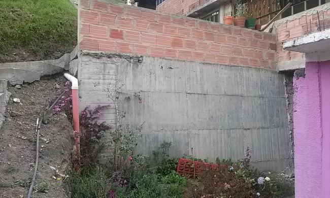

# PLAN MUNICIPAL DE GESTIÓN DEL RIESGO DE DESASTRES - TOCANCIPA

## Líneas de acción principales
El Plan Municipal de Gestión del Riesgo de Desastres (PMGRD) de Tocancipá establece estrategias para la reducción de la amenaza, la vulnerabilidad y el fortalecimiento de las capacidades locales frente a desastres naturales y antrópicos. Este plan se articula directamente con el Plan de Ordenamiento Territorial (POT) del municipio, que define los usos del suelo, la planificación urbana y la protección de las áreas ambientales estratégicas, garantizando que las medidas de gestión del riesgo sean coherentes con la planificación territorial.

### Escenario de riesgo por inundaciones (pp. 45-48)

El documento identifica que las inundaciones en Tocancipá se deben principalmente a la alteración del cauce de la quebrada La Esmeralda, la reducción de la capacidad hidráulica de los drenajes naturales y artificiales, y la ocupación de zonas de ronda y planicie de inundación. Estas condiciones se agravan por la deforestación, la minería a cielo abierto, el relleno de humedales y la construcción de viviendas sin planificación.

#### Causas principales

* Intervención antrópica sobre cauces naturales (rellenos, canalizaciones irregulares).
* Falta de mantenimiento de canales y alcantarillados.
* Sedimentación por arrastre de materiales desde zonas altas.
* Deforestación y pérdida de cobertura vegetal.
* Crecimiento urbano desordenado en sectores como La Esmeralda, Tibitó y La Fuente.

#### Zonas más afectadas

* Vereda La Esmeralda, especialmente en los sectores Quindingua, Cetina y Chiripa, donde las quebradas se desbordan por falta de control y ocupación de las rondas.

* Áreas industriales cercanas al parque industrial de Tocancipá, donde los drenajes son insuficientes.
 
#### Medidas de reducción del riesgo

* Restauración ambiental de las rondas hídricas y revegetalización de taludes.
* Obras de canalización y mantenimiento periódico de quebradas y drenajes.
* Control de vertimientos y disposición de escombros en cauces.
* Implementación de franjas de protección ambiental y prohibición de construcciones en zonas inundables.
* Articulación con el POT para ordenar el uso del suelo en función del riesgo hídrico.

#### Medidas de preparación y respuesta

* Fortalecimiento del sistema de alerta temprana local (monitoreo de caudales, pluviómetros).
* Capacitación a la comunidad y organismos de socorro (bomberos, Cruz Roja, Defensa Civil).
* Realización de simulacros de evacuación y planes familiares de emergencia.
* Definición de rutas de evacuación y puntos seguros en zonas críticas.

#### Adquisición de equipos para atención a emergencias por inundación.

* Protección financiera y recuperación post-desastre
* Creación de un fondo municipal para contingencias (FMGRD).
* Aseguramiento de bienes públicos expuestos a riesgo hídrico.
* Inclusión de criterios de reducción del riesgo en los procesos de reconstrucción y recuperación de viviendas afectadas.

Los escenarios priorizados incluyen tambien movimientos en masa, incendios forestales, y riesgos antrópicos no intencionales derivados de la actividad minera e industrial.

# Medidas específicas para la vereda La Esmeralda

La vereda La Esmeralda se identifica como una de las zonas más críticas del municipio debido a la combinación de riesgos geológicos y actividades humanas. En los sectores Quindingua, Cetina, Soler y Martínez, el PMGRD reporta procesos erosivos graves vinculados a la explotación minera a cielo abierto y al manejo inadecuado de aguas de escorrentía. 
Se observa la presencia de viviendas construidas sin condiciones estructurales adecuadas, muchas sin licencia, localizadas en zonas de ladera y taludes inestables.

Las medidas recomendadas incluyen:

* Restauración morfológica y forestal de las zonas afectadas.
* Control y seguimiento a la actividad minera y recuperación ambiental de receberas (como la de Quindingua).
* Reubicación o reforzamiento estructural de viviendas en riesgo.
* Implementación de sistemas de alerta temprana por movimientos en masa y fortalecimiento de la capacidad comunitaria de respuesta.
* Sensibilización y capacitación a la comunidad sobre el manejo adecuado del agua y la prevención de deslizamientos.

En los anexos del plan se incluyen registros fotográficos que evidencian deforestación, cortes inadecuados de terreno y asentamientos en taludes en esta vereda.

<table align="center">
  <tr>
    <td align="center">
       
      <em>Vereda La Esmeralda, sector Quindingua. Recebera Quindingua, actualmente en zona de manejo y restauración ambiental. Terreno afectado por cortes hechos para la actividad minera.</em>
    </td>
    <td align="center">
       
      <em>Vereda La Esmeralda, sector Quindingua. Zonas deforestadas y afectadas por cortes hechos debido a la explotación minera.</em>
    </td>
    <td align="center">
       
      <em>Vereda La Esmeralda, sector Cetina. Muro de contención concebido como elemento de mitigación, utilizado por los habitantes para la construcción de viviendas.</em>
    </td>
  </tr>
  <tr>
    <td align="center">
       
      <em>Vereda La Esmeralda, sector Cetina. Presencia de mangueras utilizadas para conducir agua hasta las viviendas, que producen filtración constante sobre la montaña.</em>
    </td>
    <td align="center">
       
      <em>Vereda La Esmeralda, sector Cetina. Manejo deficiente de aguas servidas que afecta el terreno.</em>
    </td>
    <td align="center">
       
      <em>Vereda La Esmeralda, sector Martínez. Construcción de viviendas sin elementos estructurales necesarios.</em>
    </td>
  </tr>
  <tr>
    <td align="center">
       
      <em>Vereda La Esmeralda, sector Chiripa. Quebradas afluentes del río Bogotá afectadas por el manejo inadecuado de aguas servidas.</em>
    </td>
    <td align="center">
       
      <em>Vereda La Esmeralda, sector Chiripa. Invasión de buchón de agua en quebradas afluentes del río Bogotá.</em>
    </td>
    <td align="center">
       
      <em>Río Bogotá. Ausencia de infraestructura adecuada para el desplazamiento de los habitantes del sector.</em>
    </td>
  </tr>
  <tr>
    <td align="center">
       
      <em>Vereda La Esmeralda, sector Chiripa. Desaparición de cuerpos de agua debido a procedimientos inadecuados en el levantamiento del jarillón.</em>
    </td>
    <td align="center">
       
      <em>Río Bogotá. Construcción de viviendas sobre el borde del río.</em>
    </td>
    <td align="center">
       
      <em>Río Bogotá. Descargue de aguas servidas sobre el río Bogotá.</em>
    </td>
  </tr>
</table>
