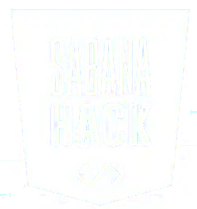
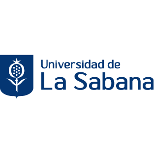
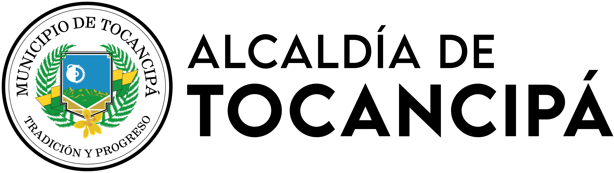
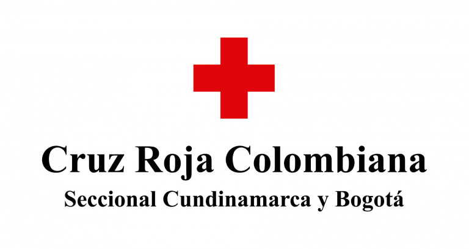

# Sabana Hack 2025
## Desarrollo de habilidades en logística humanitaria para mejorar la resiliencia comunitaria y la gestión de recursos hídricos ante riesgos de inundaciones de la quebrada La Esmeralda en Tocancipá.

## Contexto

La comunidad de la vereda La Esmeralda en Tocancipá vive en una **zona afectada por inundaciones** recurrentes de la quebrada, agravadas por sedimentación minera aguas arriba y por la falta de comunicación efectiva con las instituciones.
Aunque la comunidad reconoce el riesgo, no cuenta con sistemas de alerta temprana ni planes de emergencia. Actualmente, el aviso se hace de forma informal mediante un grupo de WhatsApp, lo cual no garantiza cobertura ni tiempo de reacción.
Las inundaciones generan aislamiento, bloqueo de caminos, pérdida de cultivos y dificultades de acceso al agua, salud y alimentos. La comunidad se apoya entre vecinos, pero carece de herramientas estructuradas para reducir el impacto y recuperarse después del desastre.

## Definición del reto:
Este desafío invita a los equipos a desarrollar una solución innovadora y aplicable en territorio, que mejore la resiliencia comunitaria ante riesgos de inundaciones. Algunas ideas que pueden considerar incluyen:

1. Sistema comunitario de alerta temprana:
Diseñar un mecanismo que permita avisar a tiempo sobre la creciente de la quebrada y coordinar la respuesta entre los vecinos.
2. Solución basada en la Naturaleza (SbN) e ingeniería comunitaria:
Proponer una plataforma integrada para la gestión y el monitoreo participativo de solución basada en la naturaleza.
3. Otras estrategias de gestión de reducción de riesgos de desastres (basadas en la prevención y preparación) 

## Condiciones que debe cumplir la solución:
* **Facilidad de uso:** la solución debe ser intuitiva, fácil de usar para la comunidad que no tienen 
experiencia avanzada en tecnología.
* **Mantenible:** la solución debe ser sostenible en el tiempo y gestionable por la propia comunidad, sin depender de recursos externos o especializados difíciles de conseguir.
* **Integración:** la solución debería facilitar el vínculo entre comunidad e instituciones (Cruz Roja, Alcaldía, Bomberos).
* **Escalable / replicable:** idealmente aplicable a otras veredas o comunidades.
* **Culturalmente adecuada:** debe respetar la identidad de la vereda y el conocimiento local.
* **Impacto medible:** la propuesta debe demostrar cómo reduce el riesgo, el tiempo de respuesta o los daños de una inundación.
* **Participación comunitaria:** la solución debe considerar el involucramiento de líderes locales, mujeres, jóvenes o sabedores del territorio.
* **Limitaciones técnicas:** el diseño de la solución propuesta debe ser viable y realista, teniendo en cuenta un presupuesto máximo estimado de $ 20 000 0000 COP.

## Patrocinio

<table align="center">
  <tr>
    <td align="center"> Universidad de La Sabana (Facultad de Ingeniería y EICEA)</td>
    <td align="center"> Alcaldía de Tocancipá</td>
    <td align="center"> Cruz Roja Colombiana Seccional Bogota y Cundinamarca</td>
  </tr>
</table>
